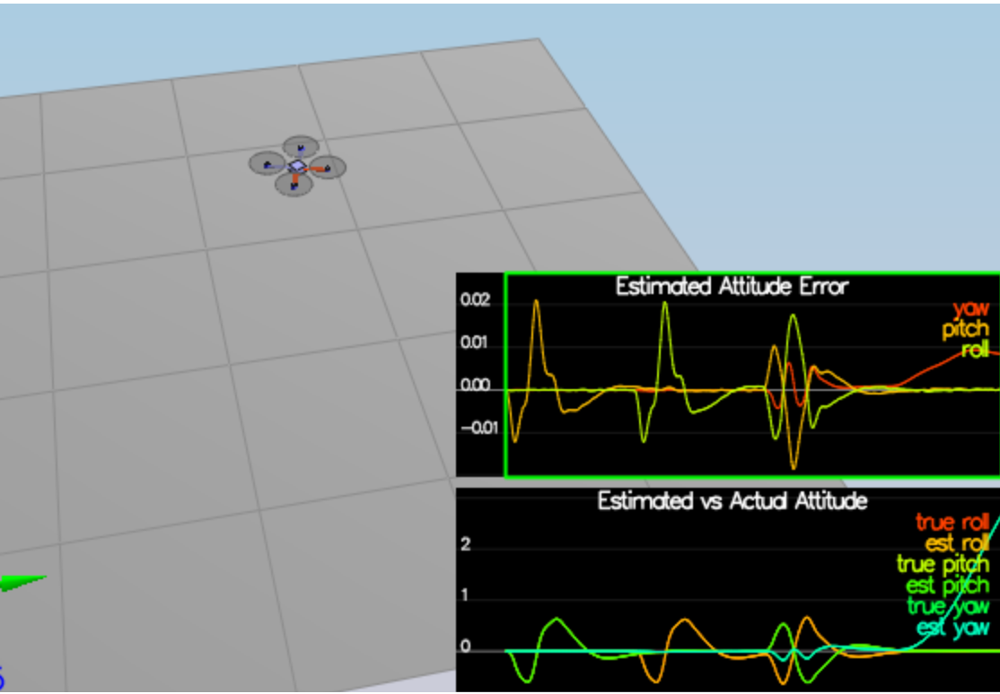
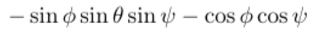
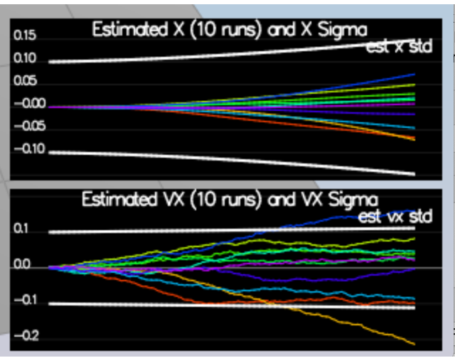
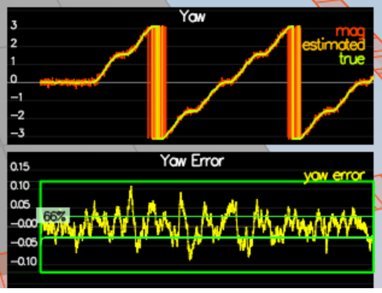
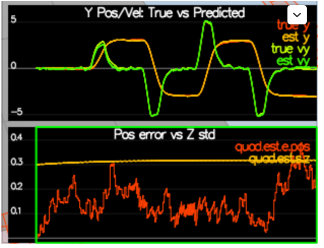
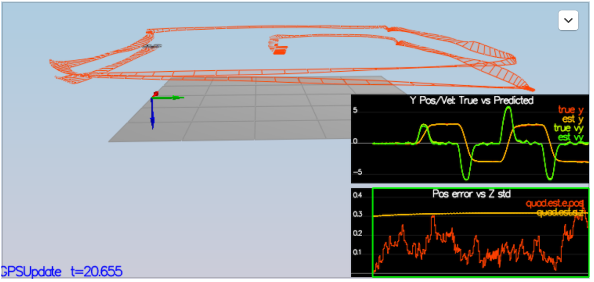

# AF-Estimation
## Project 4, Udacity FCND Course 
Udacity Self-Flying Car (Autonomous Flight) Nano Degree  

The Tasks are described in https://github.com/udacity/FCND-Estimation-CPP

Originally submitted: 2019-02-24, README updated 2019-03-21 
____

I also referred to :
1. https://github.com/mehmetyldz87/FCND-Estimation (1)
2. https://github.com/darienmt/FCND-Term1-P4-3D-Estimation (2)
3. https://github.com/clarisli/FCND-Estimation-CPP (3)
4. Estimation for Quadrotors -  https://www.overleaf.com/read/vymfngphcccj (4)


### Step 1: Sensor Noise

After capturing  a good data set I originally wanted to write a quick C++ program to determine the Standard Deviation. After about 45 minutes, it seemed I had most of the parts, but I decided that it would be much more time effective for me to just import the files into google sheets and calculate the Standard deviation there. It did not seem that this was supposed to be solved in C++. 

Here are my results:

```
MeasuredStdDev_GPSPosXY = 0.726
MeasuredStdDev_AccelXY = .5107
```


### Step 2: Attitude Estimation

Using scenario `07_AttitudeEstimation` and section *7.1.2 Nonlinear Complementary Filter* of (4), the most succinct solution was via Quaternion. Using (3) as a start, there was not much room for improvment to pass the success criteria.



### Step 3: Prediction Step

Using scenario `08_PredictState` implementing the `PredictState()` function with an ideal IMU was straight forward. It required to update the  new state for dt using the current state (36 in (4)) and acceleration as input (37 in (4)) .  

The next portion of this step was to use `09_PredictionCov` with a realistic IMU and to update  `GetRbgPrime()` using formula 52 of section *7.2 Transition Model* of (4) . However, row 1 col 2 of formula 52 in (4) may have an error. I tried both, and it did not seem to make much difference.

is:        



the second term prob should be:   
```
- cos Theta (not Phi) * cos Psi
```

The final result was:


Where the blue and orange estimated vx always ran out.

Tuning `QPosXYStd` and `QVelXYStd` only seemed to move the white lines, I could not detect any other impact.


### Step 4: Magnetometer Update

Using scenario  `10_MagUpdate`  and section 7.3.2 of (4) the update was straightforward and resulted in  



### Step 5: Closed Loop and GPS Update

Using scenario `11_GPSUpdate` and tuning  the process noise model in `QuadEstimatorEKF.txt` , I used one simple `for` loop to `UpdateFromGPS()` using equations 53 adn 55 of (4), and met the success criteria:



### Step 6: Adding your controller

Finetuning the `QuadControlParams.txt` with my own `QuadController.cpp` seemed to be by far the most time consuming step of this project. Eventually, I was able to complete  `11_GPSUpdate` within the success criteria:



```
Simulation #23 (../config/11_GPSUpdate.txt)
PASS: ABS(Quad.Est.E.Pos) was less than 1.000000 for at least 20.000000 seconds
```
